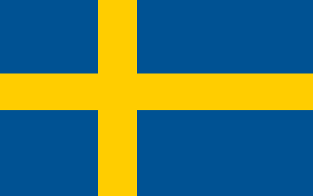

# Imogen
A DSL for generating and composing images, with Pillow providing the rendering backend.

# Why?

My original motivation was to easily generate distinct template/placeholder assets
for game development (give me 5 64x64 squares for different mob types) without having to learn / open a GUI photo/image editing program.

The composition paradigm Imogen uses has turned out to be pleasant
to work with, and with more features can serve an assets-as-code purpose.

```lua
-- Swedish Flag
local se_blue = #005293
local se_yell = #FFCD00

-- aspect ratios, horizontal and vertical
local imgh = 8
local imgv = 5

local h1 = 5
local h2 = 2
local h3 = 9

local v1 = 4
local v2 = 2
local v3 = 4

local scalef = 64

flag_se (imgh * scalef, imgv * scalef) se_blue "" {

    -- Draw the cross.
    -- The width-offset-aspect is 5:2:9, so we
    -- define an offset of 5 * scalef
    local aspect_ratio_w_px = (imgh*scalef//(h1+h2+h3))
    local flag_offset_x = int(aspect_ratio_w_px * h1)
    local cross_width = int(aspect_ratio_w_px * h2)

    local aspect_ratio_h_px = (imgv*scalef//(v1+v2+v3))
    local flag_offset_y = aspect_ratio_h_px * v1
    local cross_thick = aspect_ratio_h_px * v2
    (flag_offset_x, 0) [(cross_width, imgv * scalef) se_yell ""]

    -- Pipe operator restores the pointer to the top-left corner of the image,
    -- instead of writing the next image at the end of the current one.
    |>

    (0, flag_offset_y) [(imgh * scalef , cross_thick) se_yell ""]
}
```

`$ imogen tests/flag_se.img`



# Known bugs
* `green` as a color will parse and be black, i.e we're parsing colors without a #
* Loop variables won't compute within expressions

# Upcoming Feature

* @param to export local vars to be provided with CLI invocation
* dependency graph between assets with caching and re-rendering only as needed
* GUI for tweaking @param exports and displaying render
* dynamic image sizes, where the final size of the asset is computed from the best fit of all its constituents
* right-hand-side offsets
* sugar where composition elements without prefixed tuple are (0,0) offset

