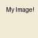
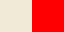

# Imogen
A DSL for generating and composing images, with Pillow providing the rendering backend.

```
$ poetry install .
$ imogen examples/flag_se.img -p
```

## Examples

### Shapes

~[](examples/shapes.png)

```lua
-- Random colored squares of random sizes at random offsets.
local tile = 64
local zpx = (0, 0)
-- Random RGB
local bg = #(int(random()*256), int(random()*256), int(random()*256))

shapes (tile * 20, tile * 20) bg "" {
     -- Add some padding to the number of iterations so we fill the whole image, since we wont be writing the full tile size each time
    zpx repeat (tile*(20+10)) {
         -- +1 to avoid 0-size due to rounding
        local size = (~int(~random()*(tile)+1), ~int(~random()*(tile))+1)
        local color = #(~int(~random()*256), ~int(~random()*256), ~int(~random()*256))
        zpx
        [
            size
            color
            ""
        ]
    }
}
```

### Swedish Flag


```lua
-- Swedish Flag
local se_blue = #005293
local se_yell = #FFCD00

-- aspect ratios, horizontal and vertical
local imgh = 8
local imgv = 5

local h1 = 5
local h2 = 2
local h3 = 9

local v1 = 4
local v2 = 2
local v3 = 4

local scalef = 64

-- Define the properties of the base image: `name (width, height) background_color background_text { <composition> }`
flag_se (imgh * scalef, imgv * scalef) se_blue "" {

    -- Prepare dimension values
    -- The width-offset-aspect is 5:2:9, so we
    -- define an offset of 5 * scalef, and round to integer
    local aspect_ratio_w_px = (imgh*scalef//(h1+h2+h3))
    local flag_offset_x = int(aspect_ratio_w_px * h1)
    local cross_width = int(aspect_ratio_w_px * h2)

    local aspect_ratio_h_px = (imgv*scalef//(v1+v2+v3))
    local flag_offset_y = aspect_ratio_h_px * v1
    local cross_thick = aspect_ratio_h_px * v2

    -- Draw the vertical bar;
    -- Specify the actual composition by giving the (x, y) offset from (0, 0) (top left)
    -- and defining an anonymous (unnamed) image `[(width, height) color text]` to paste
    -- at the offset.
    (flag_offset_x, 0) [(cross_width, imgv * scalef) se_yell ""]

    -- Pipe operator restores the pointer to the top-left corner of the image,
    -- instead of writing the next image at the end of the current one.
    |>
    -- Draw the horizontal bar
    (0, flag_offset_y) [(imgh * scalef , cross_thick) se_yell ""]
}
```


# Why?

My original motivation was to easily generate distinct template/debug/placeholder assets
for game development ("give me 5 64x64 squares for different mob types") without having to learn / open a GUI photo/image editing program. I originally wrote a program that would take a color, dimensions, and text, and generate a PNG fitting of that description; this let me quickly generate placeholders, but wouldn't let me do anything else. It turns out that a lot of things can be designed from simple shapes, if you can _compose_ them, and reuse assets already defined.

The composition paradigm Imogen uses has turned out to be pleasant to work with, but the main aspect that seems promising is allowing images to be compositional elements in other images (implemented), and establishing dependency graphs between images, so that changing an upstream image will also re-render the downstream image (not implemented). So, for example, if you have a background image `image1.img` with color `purple`, and you use this image in the composition of another image `image2.img`, if the color of image1 is changed, we can rerender all of its downstream dependencies, including `image2.img1`.

The hope is to extend this rendering-dependencies-as-text system to other types of media.

# Features

* Render images as PNGs to the filesystem
* Variables
* Syntactic sugar for colors: #(r,g,b) `#(100, 250, 134)`; HTML name `#red`; Hex `#ffeeaa`
* `local` and non-local image declarations, with `local` not being saved to the filesystem during rendering
* `repeat` for looping
* Loop variables for counting iteration
* stdlib hooks like `int` and `random`


# How?

Imogen works with a simple principle of "images" and "compositions", where an image is a named object with a size, background color, background text, and an optional composition; and a composition is a series of images to be *pasted* onto their parent image, starting from its top-left corner. Each time an image is pasted, the "top left corner" pointer moves to the bottom-right of the pasted image, wrapping according to the width of the parent image.

## Images

`my_image (128, 128) #f0ead6 "My Image"` will generate a 64-by-32 image with an "eggshell" background color and the text "My Image", and save it to the filesystem as `my_image.png` if ran without the `-p` flag:



If an image is prefixed with `local` e.g. `local my_image`, the image will render, but not be saved to the filesystem. This is useful when defining intermediate images to be used in compositions.

## Compositions

A composition is specified as a series of pairs of "offsets" and "images".
An offset is a value specifying the number of pixels to move down and right from (0,0),
the top-left corner of the base image the composition is working from.

This code

```lua
local my_image_tmp (64, 32) #red ""

my_image2 (128, 128) #f0ead6 "My Image" {
    (32, 0) my_image_tmp
}
```

Will produce a 32x32 image, with a red background, starting 32 pixels right and 0 pixels down from the top-left of its parent:



What is happening is that we've defined a `local` image, `my_image_tmp`, which is 64x32 with a red background and no text, and then specified in the composition section of `my_image2` (delimited by `{}`) that we should *paste* onto the parent image, starting from (0,0), but moving by an offset of (32, 0), before pasting.


# Known bugs
* some loop variables won't compute within expressions
* Pipe operator resets local var scope
* `green` as a color will parse and be black, i.e we're parsing colors without a #

# Upcoming Feature

* @param or `extern` to export local vars to be provided with CLI invocation or JSON specification
* Dependency graph between assets with caching and re-rendering only as needed
* GUI for tweaking @param exports and displaying render
* Dynamic image sizes, where the final size of the asset is computed from the best fit of all its constituents
* Right-hand-side offsets
* Sugar where composition elements without prefixed tuple are (0,0) offset

